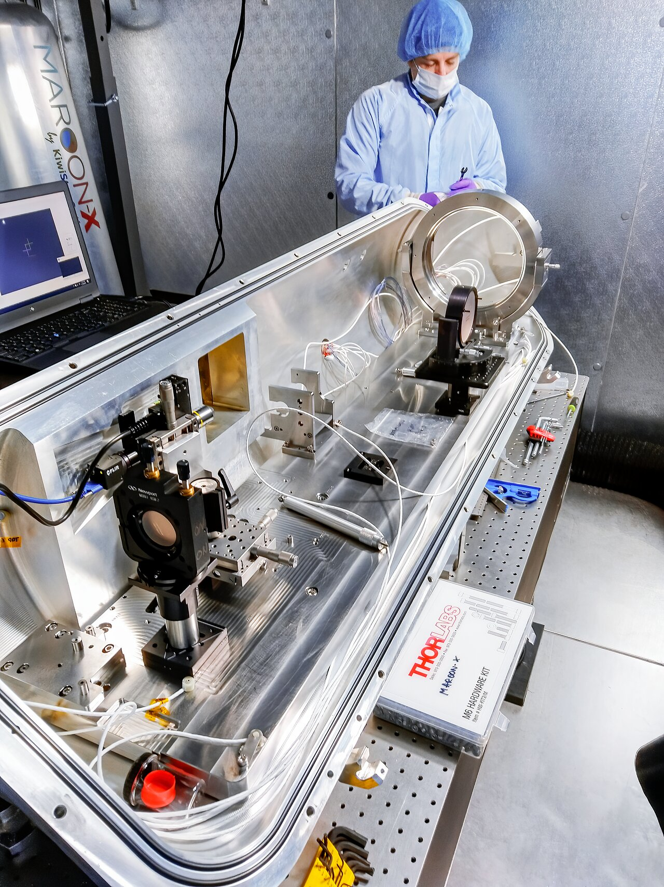

<figure>  <figcaption>Source: <a href="https://noirlab.edu/public/programs/gemini-observatory/gemini-north/maroon-x">Noir Lab</a></figcaption> </figure>

MAROON-X (M-dwarf Advanced Radial velocity Observer Of Neighboring eXoplanets) is an instrument on the Gemini-North telescope which the goal of identifying habitable planets around M-dwarf stars using radial velocities. More information can be found [on the GEMINI website](https://www.gemini.edu/instrumentation/maroon-x) or [Dr. Jacob Bean's website](https://astro.uchicago.edu/~jbean/spectrograph.html). 

Data reduction is an essential part in astrophysics research as it takes difficult to understand and noisy data and processes it into a final clean and understandable data product. MAROON-X is a spectrograph, or a specialized instrument that takes in the light from the stars and splits it up into many different wavelengths.

>[!lay]+ Spectrograph details
>An easy way to picture what a spectrograph does is the classic prism where white light goes in one side and then out the other in a rainbow. Each color is now physically separated and we can then place multiple detectors so that each one catches a different type of light. The spectrograph is the instrument that contains all of this: an opening for light, a method to split the light, and then detectors to see how much of each type of light is present.

>[!general] Echelle spectrograph details
>MAROON-X makes use of an echelle spectrograph

With MAROON-X we have been able to provide extremely precise radial velocity measurements that allow for the detection and characterization of many exoplanets. My work included both increasing the speed of the data-reduction pipeline as well as greatly reducing the required time each month for reduction by automating much of the process.

